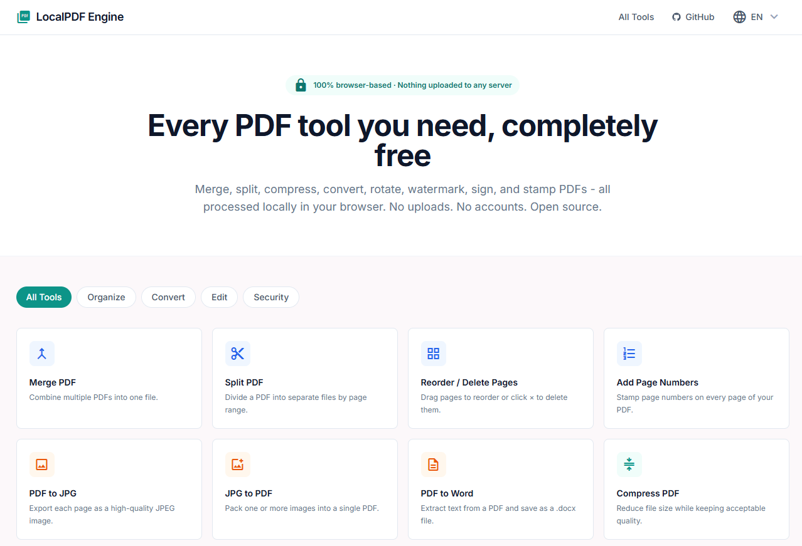

# Pdfing Pro

> A privacy-first PDF toolkit for the browser and desktop. Most tools run **100% client-side** — your files stay on your device. Website URL to PDF uses local headless-browser rendering (same approach as major online converters).

[](https://nextjs.org/)
[](https://react.dev/)
[](https://www.typescriptlang.org/)
[](LICENSE)

---

## 🎯 Features

- ✅ **Client-Side PDF Tools** - Merge, split, compress, OCR, and more run in your browser
- ✅ **Website to PDF** - Public URLs rendered with headless Chrome (local server / desktop app)
- ✅ **18+ PDF Tools** - Convert, merge, split, compress, watermark, and more
- ✅ **Intuitive UI** - Modern, responsive design for desktop and mobile
- ✅ **Real-Time Preview** - See changes instantly as you edit
- ✅ **No Installation Required** - Works directly in your browser
- ✅ **Open Source** - Full transparency, community-driven

---

## 🛠️ Available Tools

| Tool | Description |
|------|-------------|
| **Merge PDF** | Combine multiple PDFs into one |
| **Split PDF** | Extract specific pages from a PDF |
| **Compress PDF** | Reduce file size while maintaining quality |
| **Protect PDF** | Add password protection to PDFs |
| **Unlock PDF** | Remove password protection |
| **Rotate PDF** | Rotate pages 90°, 180°, or 270° |
| **Add Page Numbers** | Insert page numbers with custom styling |
| **Watermark PDF** | Add text or image watermarks |
| **Stamp PDF** | Apply stamps to specific pages |
| **Draw / Highlight PDF** | Draw freehand strokes or highlight text and annotations |
| **OCR PDF** | Extract text from scanned documents |
| **PDF to JPG** | Convert pages to high-quality images |
| **JPG to PDF** | Create PDFs from image files |
| **PDF to Word** | Extract content to Word documents |
| **Website / HTML to PDF** | Convert public webpages or local HTML into a downloadable PDF |
| **Organize PDF** | Reorder, delete, or duplicate pages |

---

## 📱 User Interface

### Desktop View

---

## 🔒 Privacy & Security Architecture

All processing happens **locally in your browser**. Here's the complete data flow:

```
┌─────────────────────────────────────────────────────────────────┐
│                     YOUR BROWSER (CLIENT)                       │
│                                                                   │
│  ┌──────────────┐         ┌──────────────────┐                 │
│  │  Your Files  │────────▶│  PDF.js Library  │                 │
│  │  (Never      │         │  (Renders pages  │                 │
│  │   uploaded)  │         │   in memory)     │                 │
│  └──────────────┘         └──────────────────┘                 │
│         ▲                           │                           │
│         │                           ▼                           │
│         │                  ┌──────────────────┐                │
│         │                  │  pdf-lib          │                │
│         │                  │  (PDF mutations)  │                │
│         │                  └──────────────────┘                │
│         │                           │                           │
│         │◀──────────────────────────┘                           │
│         │                                                        │
│    ✅ DOWNLOAD                                                  │
│    (Your edited PDF)                                           │
│                                                                  │
└─────────────────────────────────────────────────────────────────┘

                        ❌ NO CLOUD PDF UPLOAD ❌
                  ❌ NO THIRD-PARTY CONVERTER ❌
                  ❌ NO DATA TRACKING ❌

Website URL to PDF uses your **local app server** (headless Chrome), not a third-party cloud.
```

### Why Pdfing Pro?

| Aspect | Pdfing Pro | Traditional Cloud Tools |
|--------|----------|------------------------|
| **Data Privacy** | 🔐 100% private | ⚠️ Uploaded to servers |
| **Processing Speed** | ⚡ Instant | 🐢 Depends on network |
| **No Account Needed** | ✅ Yes | ❌ Requires registration |
| **Offline Support** | ✅ Works offline | ❌ Requires internet |
| **No Data Retention** | ✅ Guaranteed | ❌ Files stored on servers |
| **Cost** | ✅ Free | ⚠️ Often paid per operation |

---

## 🚀 Quick Start

### Prerequisites
- **Node.js 18.18+** and **npm 9+** (required for Next.js build and CI)
- **Node.js 25.7+** recommended if you use **Unlock PDF** (`modern-pdf-lib` declares this engine requirement)
- Modern web browser with JavaScript enabled

> **Note:** `npm install` may show an `EBADENGINE` warning for `modern-pdf-lib` on Node 18–25.6. The web app and most tools still work; only unlock/decrypt flows depend on that package.

Website to PDF requires **headless Chrome**. It is installed automatically via `postinstall`, or run manually:

```bash
npx puppeteer browsers install chrome
```

### Installation

```bash
git clone https://github.com/inievolabs/pdfingpro.git
cd pdfingpro

# Install dependencies
npm install

# Start the development server
npm run dev
```

The application will be available at `http://localhost:3000`

### Build for Production

```bash
npm run build
npm start
```

### Run Tests

```bash
npm test
```

CI runs lint, tests, and production build on Node 20 and 22 (see `.github/workflows/ci.yml`).

### Build a Desktop Executable

```bash
npm run build:desktop
```

This creates a Windows portable executable in the `release/` folder, similar to a desktop app shell.

---

## 🏗️ Project Structure

```
pdfingpro/
├── app/                      # Next.js app directory
│   ├── (tools)/             # Dynamic tool routes
│   ├── layout.tsx           # Root layout
│   ├── page.tsx             # Home page
│   └── globals.css          # Global styles
├── components/
│   ├── layout/              # Header, Footer
│   └── shared/              # Reusable components
├── lib/
│   ├── pdf/                 # PDF processing logic
│   ├── tools.ts             # Tool definitions
│   └── utils.ts             # Utility functions
├── assets/
│   └── mockup_images/       # UI mockups
└── public/                  # Static assets
```

---

## 🔧 Tech Stack

- **Framework:** Next.js 14
- **Language:** TypeScript
- **Styling:** Tailwind CSS
- **PDF Processing:**
  - [PDF.js](https://mozilla.github.io/pdf.js/) - Rendering
  - [pdf-lib](https://pdf-lib.js.org/) - Manipulation
  - [Puppeteer](https://pptr.dev/) - Website URL to PDF
- **OCR:** [Tesseract.js](https://tesseract.projectnaptha.com/)
- **Document Export:** [docx](https://github.com/dolanmiu/docx)
- **Compression:** JSZip

---

## 📖 Usage Guide

### Basic Workflow

1. **Upload PDF** - Drag and drop or click to select
2. **Choose Tool** - Select the operation you want to perform
3. **Configure** - Adjust settings in the sidebar
4. **Preview** - See changes in real-time
5. **Download** - Export your processed PDF

### Example: Merge PDFs

1. Open the "Merge PDF" tool
2. Upload multiple PDFs in order
3. Preview the merged result
4. Click "Download" to save

### Example: Add Watermark

1. Open the "Watermark PDF" tool
2. Upload your PDF
3. Enter watermark text and customize appearance
4. Click "Apply" to preview
5. Download the watermarked PDF

---

## 🤝 Contributing

We welcome contributions! Please see [CONTRIBUTING.md](CONTRIBUTING.md) for detailed guidelines on:
- Setting up your development environment
- Code standards and conventions
- Pull request process
- Bug reporting
- Feature requests

---

## 📄 License

This project is licensed under the MIT License - see the [LICENSE](LICENSE) file for details.

---

## 🙏 Acknowledgments

Built with love using:
- [Mozilla PDF.js](https://mozilla.github.io/pdf.js/)
- [pdf-lib](https://pdf-lib.js.org/)
- [Puppeteer](https://pptr.dev/)
- [Next.js](https://nextjs.org/)
- [React](https://react.dev/)

---

## 👥 Credits & Maintenance

- **Maintained & Enhanced by:** [Inievo Technologies](https://inievo.com)

---

## 🔐 Privacy Policy

Your data is your own. Pdfing Pro operates with transparency:

- ✅ No analytics tracking
- ✅ No cookies
- ✅ No third-party data sharing for PDF file uploads
- ✅ PDF file tools run client-side (files stay in your browser)
- ⚠️ **Website URL to PDF** sends the URL to your **local** app server for headless rendering — not to a third-party cloud converter
- ✅ No user accounts required

**Your uploaded PDF files are never sent to external servers.**

---

## 🚦 Roadmap

- [ ] Batch processing for multiple files
- [ ] Custom template creation
- [ ] Advanced OCR with language support
- [ ] Form filling automation
- [ ] Signature verification
- [ ] Cloud storage integration (optional, user opt-in)
- [ ] Mobile app (React Native)
- [ ] Browser extensions

---

## 📊 Stats

- **18+ Tools** ready to use
- **Most tools client-side** — files stay in the browser
- **Website URL rendering** runs on your own app server (local/desktop)
- **∞ Free** forever

---

**Made with ❤️ for privacy-conscious users everywhere.**
