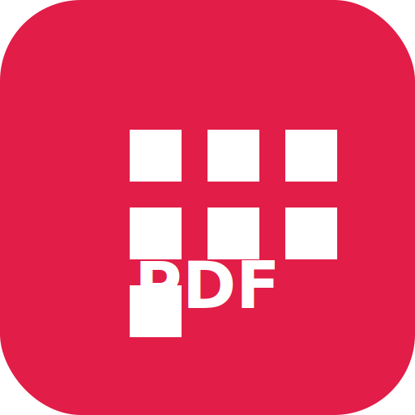

<p align="center">
  
</p>

<h1 align="center">Pdfing Pro</h1>

<p align="center">
  <strong>The privacy-first PDF toolkit — 106 tools, zero accounts, most processing in your browser.</strong>
</p>

<p align="center">
  <a href="https://nextjs.org/"></a>
  <a href="https://react.dev/"></a>
  <a href="https://www.typescriptlang.org/"></a>
  <a href="LICENSE"></a>
</p>

<p align="center">
  Merge · Split · Convert · OCR · Sign · Redact · Compress · Protect — and much more.<br />
  Built for people who care where their documents go.
</p>

<p align="center">
  <a href="#-quick-start"><strong>Quick Start</strong></a> ·
  <a href="#-tool-categories"><strong>Tools</strong></a> ·
  <a href="#-privacy-by-design"><strong>Privacy</strong></a> ·
  <a href="#-tech-stack"><strong>Tech Stack</strong></a> ·
  <a href="CONTRIBUTING.md"><strong>Contributing</strong></a>
</p>

---

## Why Pdfing Pro?

Most online PDF tools ask you to upload sensitive files to someone else's server. **Pdfing Pro flips that model.** The majority of operations run entirely inside your browser using modern Web APIs and battle-tested open-source libraries. Your PDFs stay on your device unless a tool explicitly needs server assistance — and even then, we label it clearly.

| | Pdfing Pro | Typical cloud PDF sites |
|---|---|---|
| **Privacy** | Most tools never upload your files | Files sent to remote servers |
| **Account** | Not required | Often required |
| **Cost** | Free & open source (MIT) | Freemium / per-file limits |
| **Transparency** | Every tool shows its processing tier | Processing model often unclear |
| **Offline** | PWA + desktop build supported | Requires internet |
| **Tool count** | **106 tools** across 4 categories | Usually a smaller subset |

---

## Highlights

- **106 PDF tools** — organize, convert, edit, and secure documents from one beautiful interface
- **88 local tools** — processed fully in-browser; files never leave your device
- **Transparent tiers** — Local, Limited, and Server badges on every tool ([What works](/what-works))
- **Real-time preview** — see changes instantly as you merge, split, watermark, or redact
- **Dark mode** — polished UI with responsive bento-grid home and fast tool search (`/` or `Ctrl+K`)
- **Progressive Web App** — install Pdfing Pro like a native app
- **Desktop build** — optional Windows portable executable via Electron
- **No tracking theater** — no accounts, no document analytics, no selling your files

---

## Tool Categories

Pdfing Pro ships **106 tools** grouped into four categories. Browse them all on the home page or see the full tier breakdown on **[What works](/what-works)**.

### Organize
Merge, split, rotate, reorder, extract pages, remove blanks, reverse order, N-up layouts, booklets, Bates numbering, compare PDFs, workflows, and more.

### Convert
PDF ↔ images (JPG, PNG, WebP, TIFF, HEIC), Word, Excel, PowerPoint, HTML, Markdown, JSON, CSV, text, and PDF/A. Website URL to PDF with headless rendering.

### Edit
Watermark, crop, compress, OCR, sign, redact, annotate, add page numbers, headers & footers, bookmarks, forms, QR codes, metadata, and page manipulation.

### Security
Password protect, unlock, sanitize, linearize, validate, verify signatures, and PDF/A preflight checks.

### Processing tiers

| Tier | Count | Meaning |
|------|------:|---------|
| **Local** | 88 | Runs entirely in your browser — files stay on your device |
| **Limited** | 13 | Browser-based, but output may not meet professional/compliance standards |
| **Server** | 5 | Sends input to our server (URL or Office file); result returned to you |

Server tools: Website to PDF, Word/PPT/Excel to PDF, PDF to PDF/A (server).  
Limited tools include OCR, client-side PDF/A, signature verify, and some format conversions where layout fidelity varies.

---

## Privacy by Design

```
┌──────────────────────────────────────────────────────────────┐
│                     YOUR BROWSER                             │
│                                                              │
│   Your PDF  ──▶  PDF.js / pdf-lib / Tesseract.js  ──▶  Download │
│   (stays local)         (in-memory only)                     │
│                                                              │
└──────────────────────────────────────────────────────────────┘

        ❌  No cloud PDF upload for local tools
        ❌  No third-party document storage
        ❌  No account required

Server-assisted tools (clearly labeled):
  • Website to PDF  → URL sent for headless Chrome render
  • Office to PDF   → file sent for LibreOffice WASM conversion
  • PDF/A (server)  → file sent for archival conversion
```

Read the full [Privacy Policy](/privacy) for details on each processing model.

---

## Quick Start

### Prerequisites

- **Node.js 18.18+** and **npm 9+**
- A modern browser with JavaScript enabled
- For **Website to PDF**: headless Chrome (installed automatically via `postinstall`)

> **Note:** `modern-pdf-lib` (Unlock PDF) recommends Node 25.7+. Other tools work on Node 18–22 as used in CI.

### Install & run

```bash
git clone https://github.com/abumdselim/pdfingpro.git
cd pdfingpro
npm install
npm run dev
```

Open **[http://localhost:3000](http://localhost:3000)** — all tools are on the home page.

### Production build

```bash
npm run build
npm start
```

### Tests

```bash
npm test          # unit tests (Vitest)
npm run lint      # ESLint
npm run test:smoke  # touch-tool smoke checks
```

CI runs lint, tests, and production build on Node 20 and 22.

### Desktop executable (Windows)

```bash
npm run build:desktop
```

Output: portable `.exe` in the `release/` folder.

### Headless Chrome (Website to PDF)

```bash
npx puppeteer browsers install chrome
```

Also runs automatically after `npm install`.

---

## Project Structure

```
pdfingpro/
├── app/
│   ├── (tools)/          # One route per PDF tool
│   ├── api/              # Server routes (Office→PDF, PDF/A, website render)
│   ├── what-works/       # Processing tier transparency page
│   └── page.tsx          # Bento-grid tool directory
├── components/
│   ├── home/             # Hero, cards, search, coming soon
│   ├── layout/           # Header, footer, navigation
│   ├── shared/           # ToolLayout, badges, dropzones
│   └── tools/            # Tool-specific UI (merge, redact, office, …)
├── lib/
│   ├── pdf/              # Core PDF operations
│   ├── tools.ts          # Tool registry (106 entries)
│   ├── tool-processing.ts
│   ├── generic-tools.ts  # Config-driven tool framework
│   └── generic-tool-runner.ts
├── locales/              # i18n strings
├── electron/             # Desktop shell
└── public/               # PWA icons, PDF.js worker
```

---

## Tech Stack

| Layer | Technology |
|-------|------------|
| Framework | [Next.js 15](https://nextjs.org/) (App Router) |
| UI | [React 18](https://react.dev/) + [Tailwind CSS](https://tailwindcss.com/) |
| Language | [TypeScript 5](https://www.typescriptlang.org/) |
| PDF render | [PDF.js](https://mozilla.github.io/pdf.js/) |
| PDF edit | [pdf-lib](https://pdf-lib.js.org/), modern-pdf-lib |
| OCR | [Tesseract.js](https://tesseract.projectnaptha.com/) |
| Web capture | [Puppeteer](https://pptr.dev/) |
| Office convert | [@matbee/libreoffice-converter](https://www.npmjs.com/package/@matbee/libreoffice-converter) (WASM) |
| Documents | [docx](https://github.com/dolanmiu/docx), pptxgenjs |
| Desktop | [Electron](https://www.electronjs.org/) |
| PWA | [@ducanh2912/next-pwa](https://github.com/DuCanhGH/next-pwa) |
| Tests | [Vitest](https://vitest.dev/) |

---

## Usage

1. **Pick a tool** from the home page or press `/` to search
2. **Upload** your PDF (drag & drop or click)
3. **Configure** options in the sidebar
4. **Preview** the result in real time
5. **Download** — processing stays local for most tools

Check the **Local / Limited / Server** badge on each tool before handling sensitive documents.

---

## Roadmap

- Searchable OCR PDF output
- AI document summary
- Public API access
- Cloud batch processing (opt-in)

See the **Coming Soon** section on the home page for the latest planned features.

---

## Contributing

We welcome bug reports, feature ideas, and pull requests. Please read **[CONTRIBUTING.md](CONTRIBUTING.md)** for setup, coding standards, and the PR process.

---

## License

[MIT License](LICENSE) — Copyright © 2026 [Intactic Innovations](https://intactic.tech)

---

## Acknowledgments

Built with outstanding open-source projects: Mozilla PDF.js, pdf-lib, Tesseract.js, Puppeteer, LibreOffice WASM, Next.js, and React.

---

<p align="center">
  <strong>Pdfing Pro</strong> — powerful PDF tools that respect your privacy.<br />
  An initiative by <a href="https://intactic.tech">Intactic Innovations</a>
</p>
